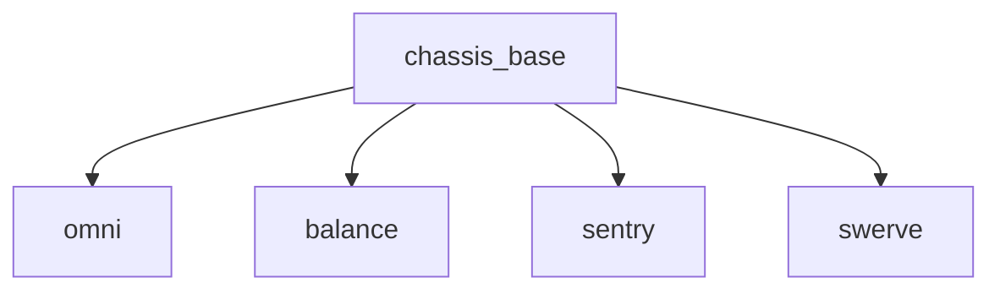

# chassis_controller

## 概述

本文件整理 `chassis` 控制器的工作流程与关键实现要点，帮助阅读源码前先掌握总体逻辑。

主要流程：
- `rm_hw` 中有一个主循环，会持续调用控制器的 `update()` 函数；
- `update()` 根据 `state` 执行不同模式（raw、follow、gyro、twist），以实现不同控制行为。

控制器模式简述：
- `raw (0)`：将速度指令转换到指定坐标系并直接解算轮驱动；
- `follow (1)`：基于某一参考坐标系（默认 `yaw`）计算偏差，通过 PID 生成 `z` 方向自转速度；
- `gyro (2)`：将 `vel_cmd` 从 `yaw` 坐标系转换为 `base_link`，通过设置 `cmd_vel.z` 实现小陀螺行为；
- `twist (3)`：利用 `follow_error` 的特性使 `vel_cmd.z` 出现扭转效果，实现“扭腰”。

---

## 代码结构（继承关系）



---

## 主要模块详解

### `chassis_base`

#### `init()`

初始化时调用一次，返回 `bool` 表示初始化是否成功。函数内含注释，按需查看源码即可。

#### `update()`（循环调用）

核心逻辑（伪码摘录）：

```cpp
void ChassisBase<T...>::update(const ros::Time& time, const ros::Duration& period)
{
    // 从实时缓冲区读取命令
    rm_msgs::ChassisCmd cmd_chassis = cmd_rt_buffer_.readFromRT()->cmd_chassis_;
    geometry_msgs::Twist cmd_vel = cmd_rt_buffer_.readFromRT()->cmd_vel_;

    // 超时处理：若超时则速度置零
    if ((time - cmd_rt_buffer_.readFromRT()->stamp_).toSec() > timeout_) {
        vel_cmd_.x = vel_cmd_.y = vel_cmd_.z = 0.;
    } else {
        // 使用命令中的加速度设置斜坡滤波器，并将速度输入滤波
        ramp_x_->setAcc(cmd_chassis.accel.linear.x);
        ramp_y_->setAcc(cmd_chassis.accel.linear.y);
        ramp_x_->input(cmd_vel.linear.x);
        ramp_y_->input(cmd_vel.linear.y);
        vel_cmd_.x = ramp_x_->output();
        vel_cmd_.y = ramp_y_->output();
        vel_cmd_.z = cmd_vel.angular.z;
    }

    // follow 和 command 源帧（默认均为 "yaw"）
    follow_source_frame_ = cmd_rt_buffer_.readFromRT()->cmd_chassis_.follow_source_frame.empty() ? "yaw" :
                                                 cmd_rt_buffer_.readFromRT()->cmd_chassis_.follow_source_frame;
    command_source_frame_ = cmd_rt_buffer_.readFromRT()->cmd_chassis_.command_source_frame.empty() ? "yaw" :
                                                    cmd_rt_buffer_.readFromRT()->cmd_chassis_.command_source_frame;

    // 状态切换检测
    if (state_ != cmd_chassis.mode) { state_ = cmd_chassis.mode; state_changed_ = true; }

    updateOdom(time, period);  // 更新 odom -> base

    // 根据状态选择控制策略
    switch (state_) {
        case RAW:   raw();   break;
        case FOLLOW: follow(time, period); break;
        case TWIST: twist(time, period); break;
    }

    // z 轴速度斜坡滤波
    ramp_w_->setAcc(cmd_chassis.accel.angular.z);
    ramp_w_->input(vel_cmd_.z);
    vel_cmd_.z = ramp_w_->output();

    moveJoint(time, period); // 子类实现：计算每个轮子的指令并设置
    powerLimit();            // 进行功率限制
}
```

---

### `updateOdom()`

功能：根据底盘里程计（`odometry()`）与外部传感器（如 Livox）信息，更新 `odom2base_` 变换并发布 odom 速度。

要点：
- 使用 `robot_state_handle_.lookupTransform` 获取已有 TF；若查找失败，会尝试发送当前 `odom2base_` 并返回；
- 将 base_link 下的速度积分到 odom2base 的平移与旋转上，更新时对速度大小做阈值判断以防 NaN 导致 TF 异常；
- 支持通过外部话题（`odom_buffer_`）根据传感器位姿计算 `world2odom_`，进而推算 `odom2base_`；
- 按 `publish_rate_` 发布 odom 速度消息并（可选）广播 odom TF。

核心伪码（略）来自源码，详见 `ChassisBase::updateOdom`。

---

### `powerLimit()`

说明：实现底盘功率限制的逻辑（队内理论文档有详细说明）。代码中只对轮子（包含字符串 `"wheel"` 的关节）参与功率累加计算。

示例片段：

```cpp
if (joint.getName().find("wheel") != std::string::npos) {
    a += square(cmd_effort);
    b += std::abs(cmd_effort * real_vel);
    c += square(real_vel);
}
```

注：`string::npos` 表示未找到，`find()` 在找不到时返回该值。

---

## 状态机模式详解

### `raw()`
- 进入 RAW 时会调用 `recovery()` 重置滤波器。
- 将速度指令按 `command_source_frame_` 转换到 `base_link`（通过 `tfVelToBase()`），然后执行逆解。

```cpp
void ChassisBase<T...>::raw() {
    if (state_changed_) { state_changed_ = false; ROS_INFO("[Chassis] Enter RAW"); recovery(); }
    tfVelToBase(command_source_frame_);
}

void ChassisBase<T...>::recovery() {
    ramp_x_->clear(vel_cmd_.x);
    ramp_y_->clear(vel_cmd_.y);
    ramp_w_->clear(vel_cmd_.z);
}
```

### `follow()`

行为：将 `command_source_frame_` 的线速度转换到 `base_link`，然后计算 `follow_source_frame_` 在 `base_link` 上的 yaw 误差，使用 PID 生成 `vel_cmd_.z`。

关键步骤：

```cpp
void ChassisBase<T...>::follow(const ros::Time& time, const ros::Duration& period) {
    if (state_changed_) { state_changed_ = false; ROS_INFO("[Chassis] Enter FOLLOW"); recovery(); pid_follow_.reset(); }
    tfVelToBase(command_source_frame_);
    try {
        double roll, pitch, yaw;
        quatToRPY(robot_state_handle_.lookupTransform("base_link", follow_source_frame_, ros::Time(0)).transform.rotation,
                            roll, pitch, yaw);
        double follow_error = angles::shortest_angular_distance(yaw, 0);
        pid_follow_.computeCommand(-follow_error, period);
        vel_cmd_.z = pid_follow_.getCurrentCmd();
    } catch (tf2::TransformException& ex) {
        ROS_WARN("%s", ex.what());
    }
}
```

---

## 小结

- `chassis_base` 实現了通用的底盤命令處理、濾波、狀態機與里程計更新；具體的車體運動學與輪子驅動細節在子類（如 `omni`、`swerve`）中實現；
- 關注點：命令的坐標系管理、斜坡濾波（ramp）、模態切換、里程計合成與功率限制。

如需，我可以：
- 根據源码為某個子類（如 `omni` 或 `swerve`）補充詳細逆解說明；
- 將關鍵函數粘貼為可直接複製的代碼片段並添加註釋。


